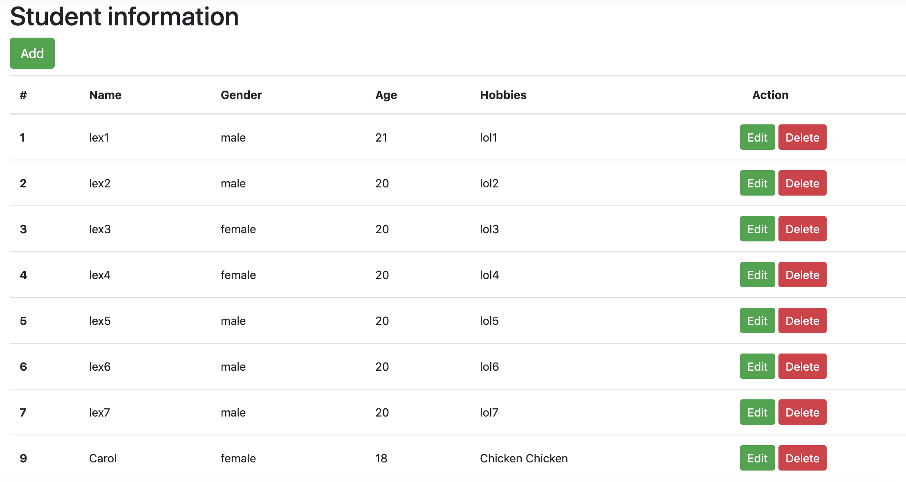

# Express - CRUD

This program is a demo to test CRUD operations with a `json` file. 

Sample:



## Initilization

- Install necessary packages and import
- HTML rendering engine - express-art-template
- Middleware
  - body-parser
  - method-override

## Route table

| Method | Route        | GET params | POST params              | Description                         |
| ------ | ------------ | ---------- | ------------------------ | ----------------------------------- |
| GET    | /students    |            |                          | *page for listing all the students* |
| GET    | /student     |            |                          | *page for adding a new student*     |
| POST   | /student     |            | name, age, gender, hobby | *action for adding a new student*   |
| GET    | /student/:id |            |                          | *page for editing a student*        |
| POST   | /student/:id |            | name, age, gender, hobby | *action for editing a student*      |
| DELETE | /student/:id |            |                          | *action for deleting a student*     |

# Callback function

Async action - retrieve the data inside the async fuction

```js
//student.js
exports.getAllStudents = function(callback) {
  fs.readFile(dbPath, function(err, data) {
    if (err) {
      return callback(err);   //callback function - format 1
    }
    callback(null, JSON.parse(data).students); //callback function - format 2
  });
};

//router.js
var st = require('./student')
router
  .get('/students', function(req, res) {
    //TODO page for listing all the students
    st.getAllStudents(function(err, data) {
      if (err) {
        return res.status(500).send('Server Error.');
      }
      res.render('index.html', {
        students: data
      });
    });
  })
```

#Use DELET HTTP request

1.  install npm package for method-override.

   ```bash
   $ npm install method-override
   ```

2. use `method-override` middleware

   ```js
   //Specify the header name a string argument of "methodOverride"
   const methodOverride = require('method-override');
   
   //Override with '_method' header in the request. You can choose your own header.
   app.use(methodOverride('_method'));
   ```

3. Query override using HTML form

   ```html
   <form action="/student/{{ $value.id }}?_method=DELETE" method="post">
     <input type="hidden" name="_method" value="DELETE">
   </form>
   ```

